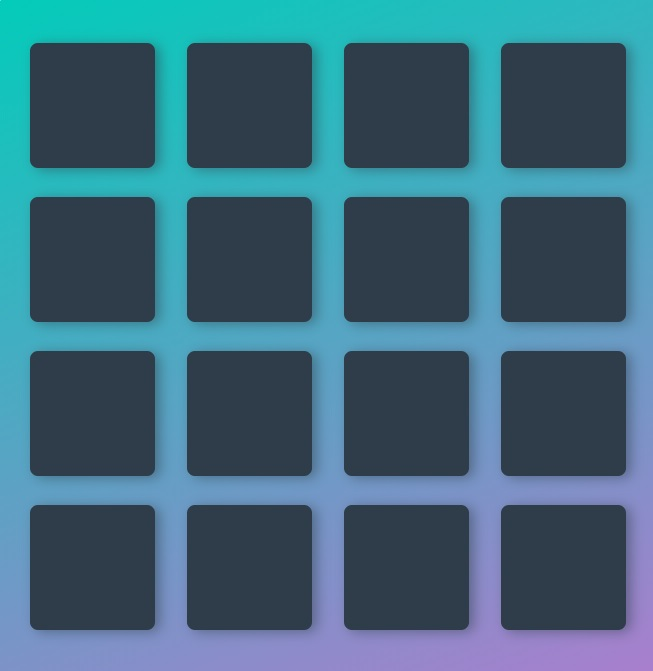

# Udacity
### Front End Web Developer
##### Memory Game Project

Game Details: 

Matching Game! Click the cards to find a match. Match all 16 cards as fast and best as you can!  

A fun game for users to play! Focuses on DOM manipulation, variables and object-oriented programming.

It's a \#SPA \#SinglePageApp

* Vanilla JS
* jQuery
* CSS3
* HTML5
* Materialize CSS: https://materializecss.com/

#### How To Run

* Download and extract via zip
* open the folder
* right click `index.html` and choose a browser
* play the game!

---

# Abdul Muqtadir
#### Web Designer/Developer
